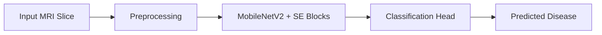

<h1 align="center">🧠 Neurodegenerative Disease Detection using Custom CNN</h1>

  <b>🎓 Undergraduate Thesis Project (Completed)</b> 
  <i>Detection of Alzheimer’s, Parkinson’s & FTD from MRI using Deep Learning</i>  
  
  
  

---

## 🚀 Overview

This research tackles early diagnosis of **Alzheimer’s**, **Parkinson’s**, and **Frontotemporal Dementia (FTD)** using **2D sagittal MRI slices** via a **pseudo-3D deep learning pipeline**.

Our custom model, **SadNetV1**, integrates **MobileNetV2** with **Squeeze-and-Excitation (SE) attention blocks** for a lightweight yet highly effective classification pipeline.

> 🧾 Successfully submitted & defended at **BRAC University, Dept. of CSE**  
> 🔐 Code & datasets are private to uphold ethical and academic guidelines.

---

## 📚 Datasets Used

- 🧠 **ADNI** – Alzheimer's Disease Neuroimaging Initiative  
- 🧠 **PPMI** – Parkinson’s Progression Markers Initiative  
- 🧠 **FTD** – Frontotemporal Dementia Neuroimaging (via IDA)

### 🧼 Preprocessing Steps

- Intensity Clipping → `[0–255]`
- Gamma Correction → `Conditional Gamma Correction`
- Contrast Enhancement → `Conditional CLAHE`
- Image Resize → `224×224`
- Normalization → `Standard scaling`
- Saved format → `.png` files for CNN input

### 🧪 Sample MRI Slice

---

## 🔄 Preprocessing Pipeline

---

## 🧬 Data Augmentation & Split

- Dataset divided into `Train`, `Validation`, and `Test`
- Augmentations: **rotation**, **zoom**, **flip**, **contrast adjustments**

### 📊 Data Split Summary

### 🔁 Augmentation Pipeline

---

## ⚙️ Model Workflow

---

## 🧠 Model Architecture – SadNetV1

- 📌 **Backbone**: MobileNetV2  
- 🧩 **Attention Layer**: Squeeze-and-Excitation (SE)  
- 🖼️ **Input**: Pseudo-3D (stacked 2D MRI slices)  
- 🧮 **Optimizer**: Adam (`lr=1e-5`)  
- ❌ **Loss**: Categorical Crossentropy  

---

## 📊 Model Performance

> ✅ Our SadNetV1 model showed consistent, strong results:

- 🟢 **Train Accuracy**: 96.84%  
- 🟡 **Validation Accuracy**: 97.11%  
- 🔵 **Test Accuracy**: 96.15%

---

## 📈 Results & Visualizations

<table>
  <tr>
    <td align="center"><b>📊 Accuracy Graph</b></td>
    <td align="center"><b>📉 Loss Graph</b></td>
  </tr>
  <tr>
    <td></td>
    <td></td>
  </tr>
</table>

---

## 🧮 Confusion Matrix – Test & Validation

<table>
  <tr>
    <td align="center"><b>Test Confusion Matrix</b></td>
    <td align="center"><b>Validation Confusion Matrix</b></td>
  </tr>
  <tr>
    <td></td>
    <td></td>
  </tr>
</table>

---

## 🧠 Prediction Results (By Class)

<table>
  <tr>
    <td align="center"><b>Predicted: Alzheimer’s Disease (AD)</b></td>
    <td align="center"><b>Predicted: Parkinson’s Disease (PD)</b></td>
    <td align="center"><b>Predicted: Frontotemporal Dementia (FTD)</b></td>
  </tr>
  <tr>
    <td></td>
    <td></td>
    <td></td>
  </tr>
</table>

---

## 🔬 Grad-CAM Heatmaps

<table>
  <tr>
    <td align="center"><b>AD: Grad-CAM</b></td>
    <td align="center"><b>PD: Grad-CAM</b></td>
    <td align="center"><b>FTD: Grad-CAM</b></td>
  </tr>
  <tr>
    <td></td>
    <td></td>
    <td></td>
  </tr>
</table>

---

## 🔭 Future Directions

- 🚀 Deploy as an interactive web app (upload MRI, view prediction)
- 🔗 Fuse MRI + PET data for multi-modal learning

---

## 🛠 Tech Stack

- 🐍 Python
- 🔥 PyTorch
- 🎞 OpenCV,Keras
- 📊 Pandas, NumPy
- 📉 Matplotlib, Seaborn
- 🧬 NiBabel, pydicom
- 📓 Jupyter Notebook

---

## 🙋‍♂️ Author, Co-author & Contact

**👨‍💻 Shahabuddin Ahmed Khan**  
🎓 B.Sc in Computer Science & Engineering  
🏫 BRAC University, Dhaka, Bangladesh  
📧 [shawon2012.sk@gmail.com](mailto:shawon2012.sk@gmail.com)  
🔗 GitHub: [@ShahabuddinAhmedKhan](https://github.com/ShahabuddinAhmedKhan)  

**👨‍💻 Shadman Rahman Sameen**  
🎓 B.Sc in Computer Science & Engineering  
🏫 BRAC University, Dhaka, Bangladesh  
📧 [shadmanrahmansameen@gmail.com](mailto:shadmanrahmansameen@gmail.com)  
🔗 GitHub: [@ShadmanRahman786](https://github.com/ShadmanRahman786)  

**👨‍💻 Mir Md. Muktasif Sakib**  
🎓 B.Sc in Computer Science & Engineering  
🏫 BRAC University, Dhaka, Bangladesh  
📧 [mir.muktasif.sakib@g.bracu.ac.bd](mailto:mir.muktasif.sakib@g.bracu.ac.bd)  
🔗 GitHub: [@Muktasif-Sakib](https://github.com/Muktasif-Sakib)

---

<i>“Turning pixels into predictions, one scan at a time.”</i>

